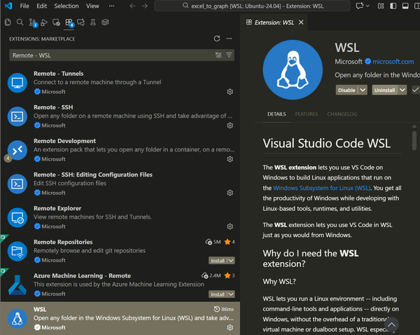
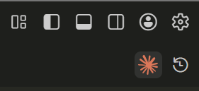

# Excel to Graph

*[English](README.md) | [Français](#)*

**Conversion Excel vers Graphiques Assistée par IA pour Simplifier la Vie de Nombreux Doctorants en Sciences Sociales**

Générez de magnifiques graphiques à partir de données Excel en utilisant Python et Claude Code - aucune expérience en programmation requise !

Ce projet aide les chercheurs en sciences sociales à visualiser les données de fichiers Excel. Parfait pour analyser des entretiens, des groupes de discussion, des enquêtes, des analyses de discours et d'autres données qualitatives ou quantitatives. Fonctionne avec n'importe quelle structure Excel - décrivez simplement ce que vous voulez visualiser en langage naturel.

## 📑 Table des Matières

- [🎯 Fonctionnalités](#-fonctionnalités)
- [📋 Prérequis](#-prérequis)
- [🚀 Guide d'Installation Complet](#-guide-dinstallation-complet)
  - [Étape 1 : Installer WSL (Windows Subsystem for Linux)](#étape-1--installer-wsl-windows-subsystem-for-linux)
  - [Étape 2 : Configurer Git dans WSL](#étape-2--configurer-git-dans-wsl)
  - [Étape 3 : Cloner ce Dépôt](#étape-3--cloner-ce-dépôt)
  - [Étape 4 : Exécuter l'Installation Complète](#étape-4--exécuter-linstallation-complète)
  - [Étape 5 : Authentifier Claude Code](#étape-5--authentifier-claude-code)
  - [Étape 6 : Ouvrir dans VSCode (Fortement Recommandé !)](#étape-6--ouvrir-dans-vscode-fortement-recommandé-)
  - [Étape 7 : Configurer l'Authentification GitHub (Optionnel)](#étape-7--configurer-lauthentification-github-optionnel)
  - [Étape 8 : Configurer les Vérifications Automatiques de Mises à Jour (Optionnel)](#étape-8--configurer-les-vérifications-automatiques-de-mises-à-jour-optionnel)
- [📊 Utilisation de l'Outil](#-utilisation-de-loutil)
  - [Travailler avec Vos Données Excel](#travailler-avec-vos-données-excel)
  - [Générer des Graphiques avec Claude Code](#générer-des-graphiques-avec-claude-code)
  - [Utiliser l'Interface en Ligne de Commande](#utiliser-linterface-en-ligne-de-commande)
- [📂 Structure du Projet](#-structure-du-projet)
- [🪟 Commandes Windows depuis WSL](#-commandes-windows-depuis-wsl)
- [🔧 Dépannage](#-dépannage)
- [🤝 Contribuer & Obtenir de l'Aide](#-contribuer--obtenir-de-laide)
- [📝 Licence](#-licence)

## 🎯 Fonctionnalités

- 📊 Visualisation flexible : Graphiques en barres, Courbes, Nuages de points, Cartes de chaleur, et plus
- 📁 Organisation par projet : Gérez plusieurs projets de recherche séparément
- 🔄 Conversion Excel vers CSV : Inspection facile des données pour Claude
- 🇫🇷 Support complet des caractères internationaux (accents français : é, è, à, ô, etc.)
- 📤 Formats de sortie multiples : PNG, PDF, HTML interactif
- 🤖 Interface en langage naturel via Claude Code CLI
- 🔒 Confidentialité prioritaire : Les fichiers Excel ne sont jamais envoyés sur GitHub
- 📦 Installation facile avec des scripts automatisés

## 📋 Prérequis

Avant de commencer, vous avez besoin de :
- Windows 10 (version 2004+, Build 19041+) ou Windows 11
- Accès administrateur pour installer WSL

## 🚀 Guide d'Installation Complet

**Vous avez déjà WSL et Git installés ?** → [Passer à l'Étape 3 : Cloner ce Dépôt](#étape-3--cloner-ce-dépôt)

### Étape 1 : Installer WSL (Windows Subsystem for Linux)

*Requis uniquement lors de la première installation. Ignorez si vous avez déjà WSL installé.*

1. **Ouvrir PowerShell en tant qu'Administrateur**
   - Appuyez sur `Windows + X`
   - Sélectionnez "Windows PowerShell (Admin)" ou "Terminal (Admin)"

2. **Installer WSL avec Ubuntu 24.04**
   ```powershell
   wsl --install Ubuntu-24.04
   ```

   **Note :** Si vous avez déjà WSL installé mais avez besoin d'Ubuntu 24.04, utilisez :
   ```powershell
   wsl --install -d Ubuntu-24.04
   ```

3. **Redémarrer votre ordinateur** lorsque vous y êtes invité

4. **Créer votre compte utilisateur Linux**
   - Après le redémarrage, Ubuntu s'ouvrira automatiquement
   - Si Ubuntu ne s'ouvre pas automatiquement :
     - Appuyez sur la touche `Windows` et tapez "Ubuntu"
     - Cliquez sur "Ubuntu" (ou "Ubuntu 24.04 LTS")
     - C'est ainsi que vous démarrerez Ubuntu à l'avenir !
   - Il vous sera demandé de créer un nom d'utilisateur et un mot de passe
   - Mémorisez ces identifiants !

5. **À propos des commandes du terminal ci-dessous**
   - Toutes les commandes qui suivent doivent être tapées dans le terminal Ubuntu
   - N'ayez pas peur - copiez et collez-les simplement une par une
   - **Important :** Pour coller dans le terminal, utilisez `Ctrl+Shift+V` (pas `Ctrl+V`). Pour copier depuis le terminal, utilisez `Ctrl+Shift+C` (pas `Ctrl+C`)
   - Appuyez sur `Entrée` après chaque commande pour l'exécuter
   - Le terminal est votre ami !

### Étape 2 : Configurer Git dans WSL

*Requis uniquement lors de la première installation. Ignorez si vous avez déjà Git configuré.*

Ouvrez votre terminal WSL (Ubuntu) et configurez git :

```bash
# Installer git s'il n'est pas déjà installé
sudo apt update
sudo apt install -y git

# Configurer votre identité
git config --global user.name "Votre Nom"
git config --global user.email "votre.email@exemple.com"
```

### Étape 3 : Cloner ce Dépôt

Dans votre terminal WSL :

```bash
# Créer le répertoire des projets
mkdir -p ~/proj
cd ~/proj

# Cloner le dépôt
git clone https://github.com/MaxenceBouvier/ez_excel_graph.git excel_to_graph

# Naviguer dans le projet
cd excel_to_graph
```

### Étape 4 : Exécuter l'Installation Complète

Exécutez le script d'installation tout-en-un :

```bash
./scripts/setup_all.sh
```

Ce script va :
1. ✅ Vérifier votre environnement WSL
2. ✅ Initialiser git et installer les hooks pre-commit
3. ✅ Installer Claude Code CLI
4. ✅ Configurer l'environnement Python avec uv
5. ✅ Vérifier l'intégration VSCode
6. ✅ Installer le package du projet
7. ✅ Optionnellement configurer les vérifications quotidiennes de mises à jour

**Note :** Le script peut demander confirmation à certaines étapes. Appuyez simplement sur Entrée pour continuer.

---

**⚠️ IMPORTANT : Redémarrez Votre Terminal Après l'Installation ! ⚠️**

Après que le script d'installation se termine, vous **DEVEZ** redémarrer votre terminal pour que les nouvelles commandes fonctionnent :

1. **Fermez complètement la fenêtre du terminal**
2. **Ouvrez un nouveau terminal Ubuntu**
3. **Retournez au projet :**
   ```bash
   cd ~/proj/excel_to_graph
   ```

**Pourquoi ?** Le script d'installation installe de nouveaux programmes (`claude` et `uv`), mais votre session de terminal actuelle ne les connaît pas encore. Redémarrer le terminal corrige cela.

---

**🔧 Si l'Installation a Échoué ou a eu des Erreurs :**

Si vous avez vu des erreurs comme `uv: command not found` ou `Virtual environment not found`, ne vous inquiétez pas ! Faites simplement :

1. **Redémarrez votre terminal** (fermez et rouvrez Ubuntu)
2. **Retournez au projet :**
   ```bash
   cd ~/proj/excel_to_graph
   ```
3. **Complétez l'installation Python :**
   ```bash
   ./scripts/setup_python.sh
   ```

Cela finira ce que le script principal a commencé.

### Étape 5 : Authentifier Claude Code

**Assurez-vous d'avoir redémarré votre terminal d'abord !** (Voir Étape 4 ci-dessus)

Démarrez Claude Code :

```bash
# Démarrer Claude Code
claude
```

**Si vous obtenez "command not found" :**
- Vous avez oublié de redémarrer votre terminal ! Fermez le terminal et ouvrez-en un nouveau.
- Ou mettez à jour votre PATH manuellement :
  ```bash
  source ~/.bashrc
  ```

**Une fois que `claude` démarre :**

Claude Code vous invitera généralement à vous connecter automatiquement au premier démarrage. Suivez simplement les instructions d'authentification à l'écran.

**IMPORTANT :** Utilisez votre **compte Claude.ai** (la version web gratuite). N'utilisez PAS "Claude Console account with API access" car cette option est payante et vous facturera !

**Note :** Si Claude ne vous invite pas automatiquement, vous pouvez déclencher manuellement l'authentification avec `/login`

**Permissions :** Le script d'installation a déjà configuré Claude Code pour exécuter des commandes courantes (Python, git, opérations sur les fichiers, etc.) sans demander d'approbation à chaque fois.

### Étape 6 : Ouvrir dans VSCode (Fortement Recommandé !)

**VSCode vous facilite BEAUCOUP la vie !** Avec VSCode vous pouvez :
- 📁 **Glisser-déposer** vos fichiers Excel directement dans le dossier `resources/`
- 📂 **Parcourir les fichiers** visuellement au lieu d'utiliser la ligne de commande
- ✏️ **Éditer les fichiers** avec une interface conviviale
- 👀 **Voir la structure de votre projet** en un coup d'œil
- 🤖 **Utiliser Claude Code avec une interface de chat** - pas besoin de commandes terminal !
- 📸 **Partager des captures d'écran** avec Claude en copiant-collant des images pour obtenir une meilleure aide

**Configurer VSCode :**

**Partie A : Installer VSCode et les Extensions (sur Windows)**

1. **Installer VSCode sur Windows** depuis https://code.visualstudio.com/

2. **Installer l'extension Remote-WSL** (nécessaire pour connecter VSCode à votre environnement Ubuntu WSL)
   - Ouvrir VSCode sur Windows
   - Aller dans Extensions (Ctrl+Shift+X)
   - Rechercher "Remote - WSL"
   - Cliquer sur Installer

   

   **Important :** Cette extension est essentielle - sans elle, VSCode ne peut pas se connecter à votre environnement Ubuntu WSL.

3. **Installer l'extension Claude Code** (optionnel mais fortement recommandé)
   - Dans VSCode, aller dans Extensions (Ctrl+Shift+X)
   - Rechercher "Claude Code" (publié par Anthropic)
   - Cliquer sur Installer
   - Une nouvelle icône Spark ⚡ apparaîtra dans la barre latérale de VSCode

   

**Partie B : Ouvrir Votre Projet depuis le Terminal Ubuntu**

4. **Retourner dans votre terminal Ubuntu** (le terminal WSL où vous avez travaillé)

5. **Vérifier que vous êtes dans le bon répertoire :**
   ```bash
   pwd
   ```

   Cela devrait retourner : `/home/votre-nom-utilisateur/proj/excel_to_graph`

   Si ce n'est pas le cas, naviguez vers le projet :
   ```bash
   cd ~/proj/excel_to_graph
   ```

6. **Ouvrir VSCode connecté à WSL :**
   ```bash
   code .
   ```

VSCode s'ouvrira avec une intégration WSL complète ! Vous pouvez maintenant glisser-déposer vos fichiers Excel dans le dossier `resources/` ou n'importe quel sous-dossier du projet.

**Bonus :** Une fois l'extension Claude Code installée, cliquez sur l'icône Spark ⚡ dans la barre latérale pour ouvrir le panneau de chat Claude Code. Vous pouvez interagir avec lui dans une interface conviviale et même coller des captures d'écran de vos données ou erreurs pour obtenir une aide plus précise !

### Étape 7 : Configurer l'Authentification GitHub (Optionnel)

**Nécessaire uniquement si vous voulez pousser des modifications vers GitHub !** Si vous voulez juste utiliser l'outil pour créer des graphiques, vous pouvez ignorer cette étape.

La façon la plus simple de s'authentifier avec GitHub depuis WSL est d'utiliser l'outil CLI `gh` :

1. **Installer GitHub CLI**
   ```bash
   # Installer gh CLI
   sudo apt update
   sudo apt install -y gh
   ```

2. **S'authentifier avec GitHub**
   ```bash
   # Démarrer l'authentification (cela ouvrira votre navigateur)
   gh auth login
   ```

3. **Suivre les invites :**
   - Sélectionner : **GitHub.com**
   - Sélectionner : **HTTPS** (le plus facile pour les débutants)
   - Authentifier Git avec les identifiants GitHub ? **Yes**
   - Comment voulez-vous vous authentifier ? **Login with a web browser**
   - Copier le code unique affiché, appuyer sur Entrée
   - Votre navigateur s'ouvrira - collez le code et autorisez

C'est fait ! Maintenant vous pouvez pousser des modifications sans être invité à entrer vos identifiants.

**Que pouvez-vous faire après l'authentification ?**
- Pousser vos modifications : `git push`
- Créer des pull requests : `gh pr create`
- Voir les issues : `gh issue list`

### Étape 8 : Configurer les Vérifications Automatiques de Mises à Jour (Optionnel)

**Restez à jour avec les dernières fonctionnalités et corrections de bugs !**

Ce projet est activement maintenu, et nous ajoutons régulièrement de nouvelles fonctionnalités et améliorations. Vous pouvez configurer des vérifications quotidiennes automatiques pour être notifié lorsque des mises à jour sont disponibles.

**Qu'est-ce que cela fait ?**
- Vérifie les mises à jour du dépôt une fois par jour (9h00 du matin)
- Vous notifie lorsque de nouveaux commits sont disponibles
- **Ne fusionne PAS automatiquement** - vous informe simplement que des mises à jour existent
- Sûr : Récupère uniquement les mises à jour, ne modifie jamais vos fichiers locaux
- Fonctionne même avec des modifications non validées

**Comment activer :**

```bash
# Exécuter le script de configuration
./scripts/setup_auto_update_check.sh
```

Le script va :
1. Configurer une tâche cron pour vérifier quotidiennement
2. Demander de démarrer le service cron (requis sur WSL)
3. Vous montrer comment le désactiver plus tard si nécessaire

**Vérifier manuellement les mises à jour à tout moment :**

```bash
./scripts/check_updates.sh
```

Cela vous montrera :
- Si votre dépôt est à jour
- Combien de commits de retard vous avez
- Un résumé des changements récents
- Instructions pour mettre à jour avec `git pull`

**Pour désactiver les vérifications automatiques plus tard :**

```bash
# Éditer votre crontab
crontab -e

# Supprimer la ligne contenant 'check_updates.sh'
# Enregistrer et quitter
```

**Note WSL :** Sur WSL, le service cron doit être en cours d'exécution. Le script de configuration vous aidera à le démarrer et peut l'ajouter au démarrage automatique lorsque vous ouvrez votre terminal.

## 📊 Utilisation de l'Outil

### Travailler avec Vos Données Excel

**IMPORTANT :** Cet outil utilise un **flux de travail basé sur des projets** pour garder votre travail organisé. Chaque projet de recherche obtient son propre dossier.


**🔒 Note de Confidentialité :** Vos fichiers Excel restent sur votre ordinateur et ne sont JAMAIS envoyés sur GitHub !

#### Créer un Nouveau Projet

```bash
# Créer un nouveau projet (choisissez un nom significatif)
excel-to-graph init ma-recherche-2024

# Cela crée : resources/ma-recherche-2024/
```

#### Ajouter Vos Fichiers Excel

**Avec VSCode (méthode la plus facile) :**
1. Ouvrir VSCode avec `code .`
2. Naviguer vers `resources/ma-recherche-2024/` dans l'explorateur de fichiers
3. Glisser-déposer vos fichiers Excel dans le dossier

**Ou avec la ligne de commande :**
```bash
# Copier votre fichier Excel dans le dossier du projet
cp ~/mes_donnees.xlsx resources/ma-recherche-2024/
```

#### Conversion vers CSV

Claude Code peut inspecter les fichiers CSV plus facilement que les fichiers Excel :

```bash
# Activer l'environnement
source .venv/bin/activate

# Convertir tous les fichiers Excel de votre projet en CSV
excel-to-graph convert resources/ma-recherche-2024/
```

Chaque feuille Excel devient un fichier CSV séparé : `<nomfichier>_<nomfeuille>.csv`

**🔒 Note de Confidentialité :** Vos fichiers Excel restent sur votre ordinateur et ne sont JAMAIS envoyés sur GitHub !

#### Gérer Plusieurs Projets

```bash
# Lister tous vos projets
excel-to-graph list

# Chaque projet peut avoir ses propres fichiers Excel et sorties
resources/
├── projet-1/
│   ├── data.xlsx
│   └── data_Sheet1.csv
├── projet-2/
│   ├── enquete.xlsx
│   └── enquete_Sheet1.csv
└── ...
```

### Générer des Graphiques avec Claude Code

#### 🌟 Utiliser Claude Code dans VSCode (Recommandé !)

**La façon la plus facile de travailler avec Claude Code est via l'interface VSCode !** Cela vous donne une interface de chat conviviale avec des capacités puissantes :

✨ **Avantages Clés :**
- 💬 **Interface de chat naturelle** - Pas besoin de ligne de commande !
- 📸 **Partager des captures d'écran** - Copier/coller des images directement pour montrer à Claude ce dont vous avez besoin
- 👁️ **Retour visuel** - Voir les modifications de fichiers et les graphiques au fur et à mesure de leur création
- 🖱️ **Pointer et cliquer** - Navigation facile entre les fichiers

**Comment utiliser Claude Code dans VSCode :**

1. **Ouvrir VSCode** (si vous ne l'avez pas déjà fait) :
   ```bash
   code .
   ```

2. **Accéder à Claude Code** via la palette de commandes VSCode :
   - Appuyer sur `Ctrl+Shift+P` (Windows/Linux) ou `Cmd+Shift+P` (Mac)
   - Taper "Claude Code" et sélectionner la commande appropriée
   - Ou utiliser l'icône Claude Code dans la barre latérale VSCode (si disponible)

3. **Discuter naturellement avec Claude** dans le panneau VSCode :
   ```
   "Montre-moi la structure de mes données Excel dans resources/"

   "Crée un graphique en barres à partir des données dans resources/mon-projet/enquete.xlsx"

   "Aide-moi à comprendre ce message d'erreur"
   ```

4. **Partager des captures d'écran pour obtenir une meilleure aide !**
   - Prendre une capture d'écran de vos données Excel, message d'erreur, ou graphique
   - Simplement **copier et coller** l'image dans le chat Claude Code
   - Claude peut voir l'image et fournir des conseils spécifiques
   - Exemple : "Claude, voici une capture d'écran de mes données [coller l'image]. Peux-tu créer une visualisation chronologique à partir des colonnes B et C ?"

#### 💻 Utiliser Claude Code depuis le Terminal (Alternative)

Si vous préférez la ligne de commande ou avez besoin d'utiliser des commandes terminal :

```bash
# Activer l'environnement Python
source .venv/bin/activate

# Démarrer Claude Code
claude
```

#### Exemples de Prompts :
```
"Montre-moi la structure de mes données Excel dans resources/"

"Convertis tous les fichiers Excel de resources/etude-interviews/ en CSV"

"Crée un graphique en barres comparant les valeurs de la colonne A"

"Génère un nuage de points âge vs temps_réponse depuis sondage.xlsx"

"Crée une visualisation HTML interactive que je peux explorer"
```

**💡 Astuce :** Que vous utilisiez VSCode ou le terminal, vous pouvez demander à Claude d'expliquer n'importe quoi dans le projet. Claude a le contexte complet du code et peut aider à dépanner, suggérer des améliorations, et vous guider à travers des tâches complexes !

### Utiliser l'Interface en Ligne de Commande

Pour des opérations rapides sans Claude Code :

```bash
# Activer l'environnement
source .venv/bin/activate

# Créer un nouveau projet
excel-to-graph init mon-projet

# Convertir tous les fichiers Excel d'un projet en CSV
excel-to-graph convert resources/mon-projet/

# Lister tous les projets
excel-to-graph list

# Voir toutes les options
excel-to-graph --help
excel-to-graph init --help
excel-to-graph convert --help
```

## 📂 Structure du Projet

```
excel_to_graph/
├── README.md                     # Ce fichier
├── resources/                    # Fichiers Excel (jamais envoyés sur git)
│   ├── README.md                # Guide d'organisation
│   ├── example_template.xlsx    # Modèle générique
│   ├── projet-1/                # Vos projets...
│   │   ├── README.md
│   │   ├── data.xlsx
│   │   └── data_Sheet1.csv      # CSV auto-généré
│   └── projet-2/
├── outputs/                      # Graphiques générés (auto-créé)
│   ├── png/                     # Images PNG
│   ├── pdf/                     # Fichiers PDF
│   ├── html/                    # HTML interactif
│   ├── projet-1/                # Sorties spécifiques au projet
│   └── projet-2/
├── scripts/                      # Scripts d'installation & de projet
│   ├── setup_all.sh             # Script d'installation principal
│   ├── projet-1/                # Scripts personnalisés par projet
│   └── ...
└── src/excel_to_graph/          # Code source Python
```

## 🪟 Commandes Windows depuis WSL

Vous pouvez utiliser des applications Windows depuis votre terminal WSL :

```bash
# Ouvrir l'Explorateur de Fichiers dans le répertoire actuel
explorer.exe .

# Ouvrir VSCode dans le répertoire actuel
code .

# Ouvrir un fichier avec le Bloc-notes Windows
notepad.exe nomfichier.txt
```

## 🔧 Dépannage

### Problèmes du Script d'Installation

#### "command not found: claude" ou "command not found: uv"

**C'est le problème le plus courant !** Il se produit parce que le script d'installation a installé de nouveaux programmes, mais votre session de terminal ne les a pas encore chargés.

**Solution :**
1. **Fermez complètement votre terminal**
2. **Ouvrez un nouveau terminal Ubuntu**
3. **Réessayez :**
   ```bash
   cd ~/proj/excel_to_graph
   claude --help
   ```

**Alternative (sans redémarrer) :**
```bash
source ~/.bashrc
```

#### "uv: command not found" pendant setup_all.sh

Si le script d'installation a affiché cette erreur, cela signifie que l'environnement Python n'a pas été créé. C'est normal - cela se produit parce que `uv` a été installé mais pas encore chargé.

**Solution :**
1. **Redémarrez votre terminal** (fermez et rouvrez)
2. **Retournez au projet :**
   ```bash
   cd ~/proj/excel_to_graph
   ```
3. **Exécutez l'installation Python :**
   ```bash
   ./scripts/setup_python.sh
   ```

Cela complète l'installation !

#### "Virtual environment not found" à la fin de l'installation

Cela se produit si l'étape d'installation Python a échoué (généralement à cause du problème `uv` ci-dessus).

**Solution :** Identique à ci-dessus - redémarrez le terminal et exécutez `./scripts/setup_python.sh`

#### Le script d'installation semble bloqué ou demande un mot de passe

- S'il demande votre mot de passe Ubuntu, tapez-le et appuyez sur Entrée (vous ne verrez pas le mot de passe pendant que vous tapez - c'est normal !)
- Appuyez sur Entrée quand invité à continuer
- Appuyez sur Ctrl+C si vous devez annuler

#### Vous voulez réexécuter le script d'installation ?

**Oui, c'est sûr !** Le script vérifie ce qui est déjà installé et ne cassera rien. Vous pouvez exécuter `./scripts/setup_all.sh` autant de fois que nécessaire.

**Meilleure approche :** Si seule la partie Python a échoué, exécutez simplement :
```bash
./scripts/setup_python.sh
```

### Problèmes d'Utilisation

#### "Virtual environment not activated"

Activez toujours l'environnement Python avant d'utiliser les outils :
```bash
source .venv/bin/activate
```

Vous verrez `(.venv)` dans votre invite quand activé.

#### "Excel file not found"

Assurez-vous que vos fichiers Excel sont dans le répertoire `resources/` :
```bash
ls resources/
```

#### Git ne me laisse pas commit

Si vous essayez de commit un fichier Excel (sauf le modèle), le hook pre-commit le bloquera. C'est intentionnel pour protéger la confidentialité de vos données !

### Problèmes VSCode

#### "code: command not found"

VSCode doit être installé sur **Windows**, pas dans WSL :

1. Télécharger depuis https://code.visualstudio.com/ (version Windows)
2. Installer l'extension "Remote - WSL" dans VSCode
3. Puis depuis le terminal WSL : `code .`

**Note :** VSCode est optionnel - vous pouvez utiliser n'importe quel éditeur de texte que vous préférez !

### Vous Avez Toujours des Problèmes ?

1. **Lisez attentivement le message d'erreur** - il vous dit souvent ce qui ne va pas
2. **Vérifiez que vous êtes dans le bon répertoire :**
   ```bash
   pwd
   # Devrait afficher : /home/votre-nom-utilisateur/proj/excel_to_graph
   ```
3. **Vérifiez que l'environnement Python existe :**
   ```bash
   ls .venv
   # Devrait afficher des fichiers/répertoires
   ```
4. **Demandez de l'aide à Claude Code :**
   ```bash
   claude
   > "J'obtiens cette erreur : [coller le message d'erreur]"
   ```
5. **Créez une issue GitHub** avec les détails de votre erreur

## 🤝 Contribuer & Obtenir de l'Aide

Si vous rencontrez des problèmes ou voulez suggérer des améliorations :

1. **Vérifiez les issues existantes** sur GitHub
2. **Créez une nouvelle issue** avec les détails de votre problème. (Demandez à Claude de créer un rapport.)
3. **Demandez de l'aide à Claude Code** :
   ```bash
   claude
   > "J'ai des difficultés avec [décrire votre problème]"
   ```

## 📝 Licence

Licence MIT - Voir le fichier LICENSE pour les détails

## 🎉 Bonnes Visualisations !

Une fois l'installation terminée, vous pouvez générer de magnifiques visualisations à partir de vos données Excel en utilisant de simples commandes en langage naturel !

Pour une utilisation plus avancée et des exemples, explorez le code dans `src/excel_to_graph/` ou demandez de l'aide à Claude Code.
